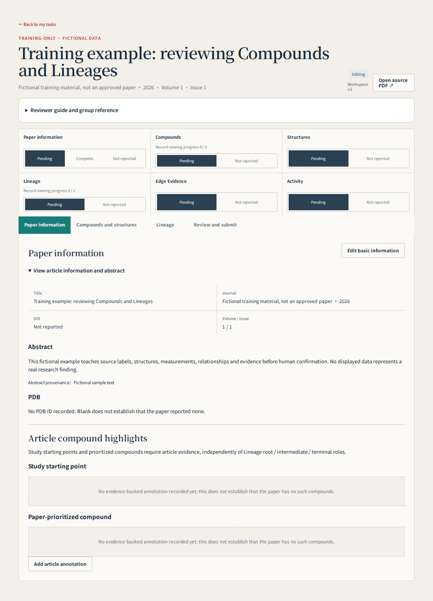
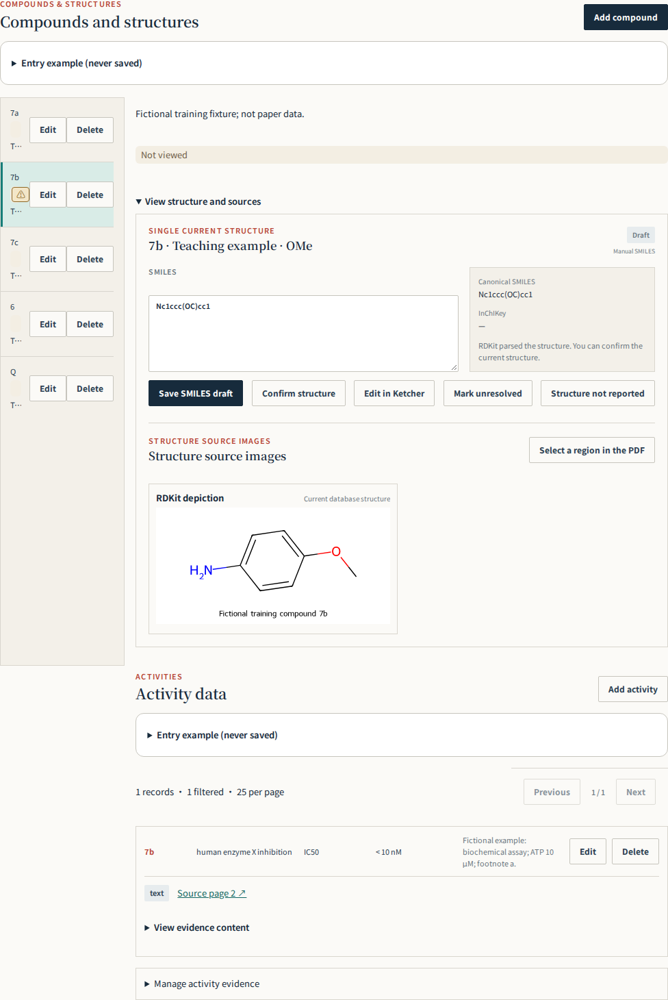
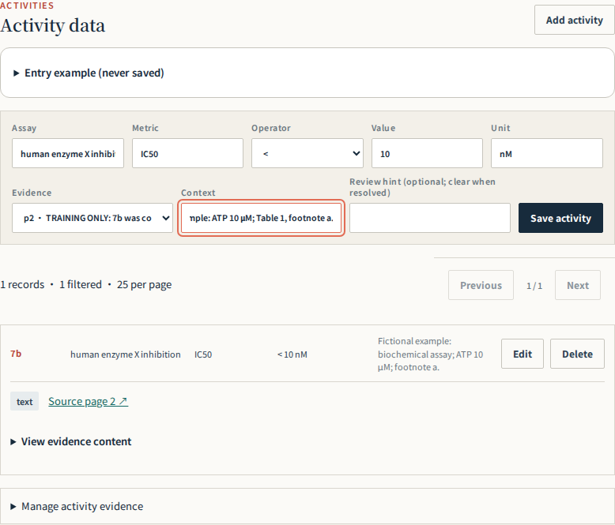
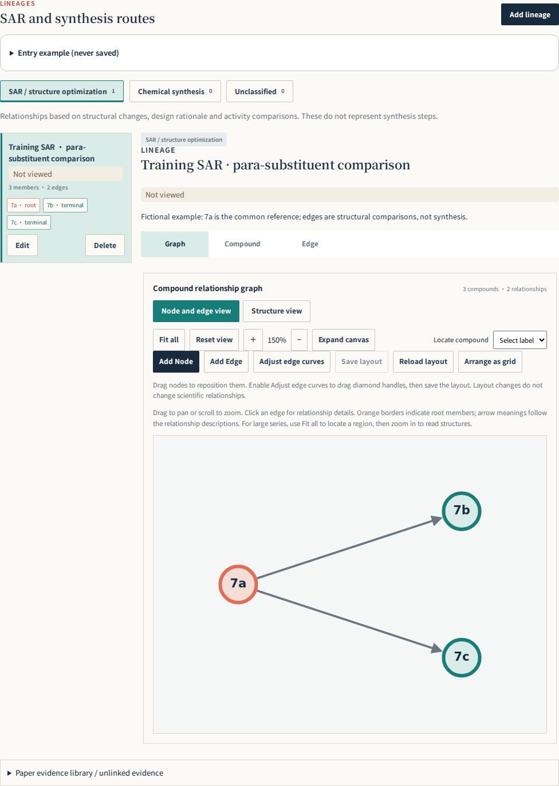
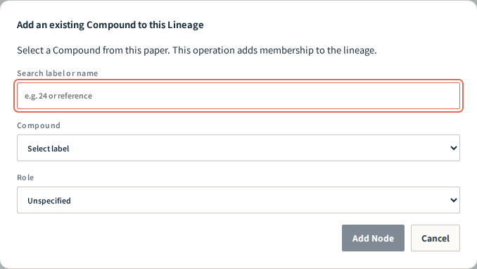
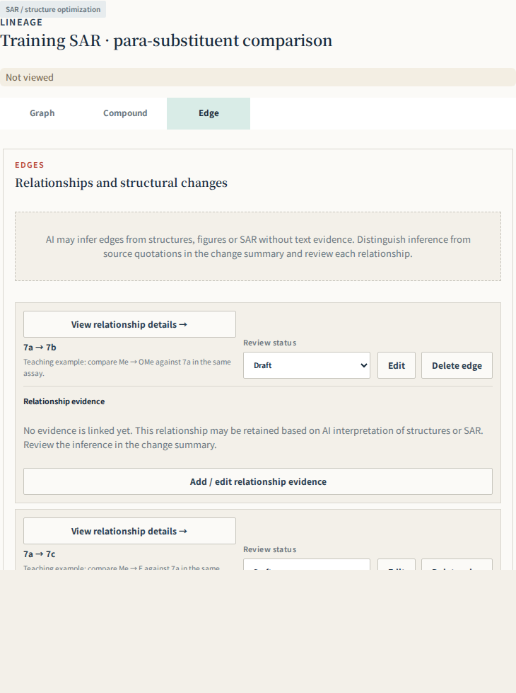
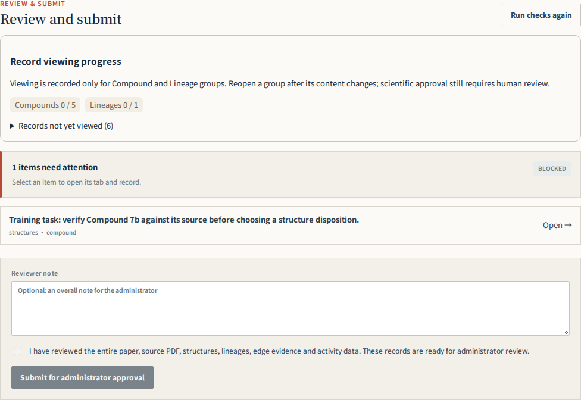

# Reviewer illustrated handbook

Version: 2026-10-08

> Generated from `leadtrace/frontend/src/review/help/reviewer-guide.json`. Edit that source and run `python leadtrace/ops/reviewer/render_guide.py`.

## 01 · Your first paper

Your task is to turn paper content into traceable, checked records. AI prefill is a draft. Keep uncertainty visible and ask your supervisor when chemistry is unclear; do not guess to finish.

1. Sign in with the supplied Reviewer account and open an assigned paper from My tasks. Match the title and DOI. A Preview banner identifies the preview environment; distinguish training from real assignments.
2. Read the abstract, main figures/tables, synthesis schemes and conclusion to identify the target, starting compounds and authors’ priorities. You do not need to edit every field immediately.
3. Follow Article information → Compounds and structures → Lineage → Review & submit. Start with one Compound: label, structure, source image and Activity; then inspect its Lineage and Edges.
4. Work on one item at a time. Save and verify the updated display. Placeholder examples are not paper data and must not be saved as facts.
5. Check uncertainties and sources for each group before checking whole-paper coverage and submission. Practise in a training assignment supplied by your supervisor, never by inserting this guide’s fictional molecules into a real paper.

> Screenshots show the real workbench with fictional teaching data. Values, labels and research statements illustrate operation only. Screenshots match each guide’s interface language; common field names are retained for comparison.



Find the four main tabs. Section status, viewing progress and scientific review status serve different purposes, explained below.

## 02 · Eight objects to recognize

Separate molecular identity, measurements, relationships and supporting sources before entering data.

| Object | Plain meaning | Where it belongs / example |
|---|---|---|
| Paper / Workspace | A paper / its review workspace | Keep records for the same paper together |
| Compound | An identified compound in the paper | Label 7a, 24 or an explicit author label |
| Structure | The chemical structure for that identity | Atoms, bonds, attachment positions and stereochemistry |
| Activity | One measurement for that molecule | An IC50, solubility or other assay result |
| Lineage | Compounds grouped by design or synthesis logic | An SAR series or a synthetic route |
| Node / Member | A Compound participating in a Lineage | Select an existing Compound, not a duplicate molecule |
| Edge | A relationship between two members | A → B comparison or synthetic transformation |
| Evidence | Source supporting or explaining a record | PDF page, exact quotation or table/figure region |

A Compound may have several Activities and participate in several Lineages. The same molecule can be a synthesis product and an SAR comparison member; reuse the Compound in both groups.

## 03 · Identify the paper and inventory every compound

Verify title, DOI and PDF. Include every numbered or labelled Compound with a determinable structure, including starting materials, intermediates and controls without activity data. Examples illustrate format and are not paper facts.

1. Match the title, DOI, journal and year, and confirm that Source PDF belongs to this paper. Stop work on a mismatched source and report it.
2. Use the PDF viewer’s physical page number, starting at 1. A printed journal page such as 3456 is not PDF page 3456. Record the physical page together with Table 2 or Scheme 1.
3. Inspect text, tables, figures, schemes, experimental methods and available supplementary material. Inventory each source label, location, determinable structure, presence in the workspace and uncertainty.
4. Audit label ranges individually, for example 24–31 and 55–73. Consecutive labels do not imply similar structures; a numbering gap is a reason to inspect the source, not proof of an omission.
5. Include identifiable, structurally defined starting materials, intermediates, controls and comparison compounds. Lack of Activity does not exclude a Compound.

> If only a label is known and no complete structure can be established, retain the label, source page and gap in your issue log for the supervisor; do not copy a neighboring structure. A complete source-supported candidate with a specific uncertainty may carry a verification hint. Record unavailable SI as a coverage limit rather than claiming exhaustive coverage.

## 04 · Compound labels and identity

Keep source labels such as 24 or 7a; display name is optional. Each Compound has one Structure. Verify connectivity, substitution and stereochemistry after entering SMILES or using the structure editor. Explain unresolved identity rather than inventing a structure.

| Field | What to enter | Common mistake |
|---|---|---|
| Compound label | Keep source labels and meaningful distinctions such as 7a or (R)-24 | Replacing source labels with your own sequence |
| Display name | An author alias or established name; leave blank if absent | Interpreting a number in an alias as the paper label |
| Description | Purpose, source, series and why no Lineage applies | Writing only “none” without an explanation |
| Verification hint | Specific uncertainty, source location and what must be checked | Vague “AI may be wrong” or clearing it before resolution |

1. Select a source label on the left and confirm the detail panel shows the same compound. Before Add Compound, check whether the label already exists.
2. After saving the label, complete structure and source checks. Use Edit for purpose and uncertainty notes. Identical-looking structures alone do not justify merging author-distinguished identities.
3. Stereoisomers, salts, tautomers and reused labels require care. Follow explicit author identity and structure; ask your supervisor before normalizing unfamiliar cases.



The left panel lists this paper’s Compounds; the right panel contains the selected structure, sources and Activities. Check one label at a time to avoid mixing neighboring records.

## 05 · Structure review: check the molecular graph

You can learn to compare drawings before learning to write SMILES. Do not mark a structure confirmed when you cannot assess it. Focus on which atoms and bonds are connected.

1. Locate the exact labeled drawing or shared scaffold plus the compound-specific substituent row. R, R¹ and R² are variables, not resolved atoms.
2. Trace each ring and count atoms; distinguish five- and six-membered rings. Fused rings share an edge, spiro rings one atom, and bridged systems have different connectivity. Overall shape or a similar name is insufficient.
3. Check atom identity and position: C, N, O and S. Moving one aromatic N changes the molecule. Unlabeled skeletal vertices usually represent carbon; read the drawing conventions carefully.
4. Follow each attachment from the scaffold: Me versus OMe, Ph versus Bn, chain length and ortho/meta/para position. Bn adds CH₂ relative to Ph; OMe adds O relative to Me.
5. Check single/double/aromatic bonds, carbonyl location, formal charges, explicit hydrogens, salt components, wedges/dashes and E/Z. Do not assign stereochemistry that the source leaves unspecified.
6. Inspect the regenerated drawing after saving. Different SMILES can describe the same structure; parser acceptance establishes readable syntax, not source correctness. Set the structure disposition only after review.

Both input methods save the same Structure. After drawing in Ketcher, choose Save Ketcher Draft. When parsing succeeds, the SMILES field automatically shows the generated result and the RDKit depiction updates to the saved structure; no manual copy or second SMILES save is needed. Editing SMILES and choosing Save SMILES Draft also updates the depiction. The image represents saved content, not unsaved typing; an invalid draft has no usable depiction and needs correction. Saving a draft is not scientific confirmation: check the source before Confirm Structure.

| Status | Meaning / when to use |
|---|---|
| draft | Entered or prefilled, not yet fully checked |
| reviewer_confirmed | You verified the current structure against its source |
| unresolved | Source ambiguity or a problem you cannot resolve; explain it |
| not_reported | The source does not report the structure information; do not use merely because you cannot find or draw it |

> Ring size, heteroatom position and attachment points are frequent beginner errors. Keep a specific unresolved note if any cannot be checked. A generic scaffold crop also requires the matching substituent row.

> Actual button behavior: Mark unresolved and Structure not reported clear the current SMILES / Molfile and save a no-structure disposition. If a complete candidate has a specific uncertainty, retain the Draft and explain it in the Compound verification hint. These buttons are not simple warning toggles. Preserve sources and an issue record and consult your supervisor before choosing a no-structure disposition.

## 06 · Activity: entering a measurement

Fictional example: Assay = human MAO-B inhibition; Metric = IC50; Operator = <; Value = 10; Unit = nM; Context records assay conditions. Do not put <10 nM entirely in Value or combine different assays. Preserve units and qualifiers.

| Field | Fictional example | How to read it |
|---|---|---|
| Assay | human enzyme X inhibition | Target and assay system, not just “activity” |
| Metric | IC50 | Endpoint, distinct from Ki, EC50 or percent inhibition |
| Operator | < | Preserve the reported inequality |
| Value | 10 | Numeric value only |
| Unit | nM | Source unit; 1 μM = 1000 nM |
| Context | Biochemical assay; ATP 10 μM; Table 1 footnote a | Retain conditions, replicates, uncertainty and qualifiers |
| Evidence | PDF p. 2, Table 1, row 7a | Link a source that locates this measurement |

IC50 usually denotes the concentration producing 50% inhibition; lower values generally indicate stronger inhibition within the same assay. EC50, Ki, Kd, viability, solubility and exposure answer different questions. Even IC50 values from different targets, species, cell lines, times or conditions are not automatically comparable.

1. Confirm the selected Compound before Add Activity. Save separate records for separate assays rather than overwriting a different measurement.
2. Read the row label, column heading, units and footnotes together. For 12 ± 3 nM, enter 12 as Value and preserve ±3 and its stated SD/SEM meaning in Context; never guess the error type.
3. ND, NT and inactive are not numeric zero. Preserve their reported meaning and conditions in notes/evidence; ask your supervisor if the numeric form cannot represent them faithfully.
4. After saving, open the evidence and verify the crop contains the right compound, endpoint and units.



Fictional <10 nM example: enter operator, number and unit separately, retain conditions in Context and link source Evidence.

## 07 · Evidence and crops: make records traceable

Verify relationship type, endpoints and modification summary. Fictional format example: Me → OMe, comparing lipophilicity; relationship inferred from structures, not explicitly stated by the authors. Distinguish source support from inference; table order is not optimization order. Evidence retains exact quotations, actual PDF page and region. supports/contradicts/contextual describe evidence roles. Viewing never changes draft to reviewer_confirmed.

Evidence provides a checkable source. Use quoted text for verbatim wording, Caption for Table/Figure/Scheme identification, and Reviewer note for interpretation, translation or inference. Do not present your interpretation as an author quotation.

1. Open Evidence from the Activity area or Add / edit relationship evidence in a Lineage. Reuse existing evidence where appropriate.
2. Check the PDF page and orientation before selecting a region. For an Activity table, include the compound row label, endpoint heading, unit and relevant footnote. Avoid illegibly broad or context-free tiny crops.
3. Inspect the generated image after saving, not just the selection rectangle. Verify label, endpoint, value, unit and footnote against the intended row and column.
4. For blank, shifted or neighboring-result crops, correct the source page/region. Retry generation when offered, but retrying cannot repair incorrect coordinates.
5. For Edge evidence, supports, contradicts and contextual mean support, contradiction and background. A passage may support only one relationship; do not automatically attach it to every edge.

> A missing generated crop does not mean missing source data; an existing image does not prove correctness. A table spanning pages may require several source locations, which should be identified in the reviewer note.

## 08 · Lineage: distinguish SAR from synthesis

SAR describes design and structural comparison; synthesis describes chemical routes. Never connect compounds solely by label order. Keep one logical route together; separate independent routes. Root starts a route, intermediate is internal, terminal ends it. Terminal does not automatically mean best activity or nominated lead; record author starting points and prioritized compounds in article annotations. Do not force isolated controls into a lineage: document their purpose and exclusion in the Compound description.

| Category | Question answered | Possible source support | Avoid |
|---|---|---|---|
| SAR | How were structures designed/compared to explore properties? | Design statements, structural comparisons, comparable assays and scope | Automatically chaining labels 1→2→3 |
| synthesis | Which precursors give which products? | Scheme arrows, methods and explicit multistep paths | Treating improved activity as synthesis |
| Isolated control | Why is this molecule present without an optimization relationship? | Initial comparisons or an external reference standard | Inventing an edge merely to connect every node |

1. Describe one common question for the group, such as “compare para substituents on a shared scaffold.” Use another group for its shared synthetic route.
2. Keep members of a logical route or comparison series together. For a fragmented diagram, distinguish layout spacing from missing members/edges, incorrect endpoints or unrelated routes.
3. Record missing support as uncertainty rather than inventing connecting edges. Split truly independent series/routes on scientific grounds. SAR evidence may support only some pairwise relationships.
4. Allow branching from a shared intermediate to several products; do not force products into a linear chain. Reuse the same Compound across relevant groups.

```text
Fictional SAR example
7a (Me) → 7b (OMe)
7a (Me) → 7c (F)
A stated common reference; arrows represent supported comparisons, not synthesis of 7c from 7b.
```



A branching example Lineage. Check its category and grouping rationale, then members and the support for each edge. Node position is presentation only.

## 09 · Local roles versus article annotations

A Lineage role describes position within that group. Study starting point / paper-prioritized annotations describe author choices for the study or a named series. Review them separately.

| Name | How to decide | Does not mean |
|---|---|---|
| root | A starting node in the directed group; check direction and context | Automatically a study starting point |
| intermediate | An internal node, typically with incoming and outgoing relationships | Automatically a synthetic intermediate in an SAR group |
| terminal | An endpoint with no further recorded outgoing relationship | Best potency, final medicine or author-prioritized compound |
| unspecified | Role not yet determined; further review needed | A permanent shortcut around review |
| Study starting point | An author-supported starting molecule for this study/series | Every reagent or first material in a synthesis |
| Paper-prioritized compound | A molecule the authors explicitly choose to advance, with rationale | Every terminal or the reviewer’s lowest-IC50 choice |

The same Compound can have different roles in different Lineages. A study can have several starts and priorities, and one molecule may carry both annotations. The key is the authors’ scope and rationale, not row order.

## 10 · Editing a Lineage in graph and forms

Switch between three tabs. Add Node selects an existing Compound from this paper; create missing Compounds on the compound page first. Add Edge selects source then target before opening the relationship form. Drag nodes or diamond control handles and Save layout. Point and structure modes save separately. Reload layout discards unsaved layout in that mode. Full forms remain available.

1. Select the correct SAR / synthesis category and Lineage, then switch Graph / Compound / Edge; each tab uses the main work area.
2. Choose Add Node on the canvas, find an existing Compound and select its local role. If the label is absent, first check whether it is already a member; create a genuinely missing Compound on the compound page.
3. Choose Add Edge, then source and target as prompted. In the Edge form recheck both labels, direction, relation type, modification summary and evidence. Cancel before saving to avoid creating a relation.
4. Alternatively add a Member in the Compound tab and use full forms in the Edge tab. Both interfaces edit the same records.
5. Drag nodes; enable edge bending to drag diamond control handles. Choose Save layout. Point and structure modes keep separate layouts.
6. Reload layout discards unsaved positions in the current mode; grid rearrangement changes presentation. Moving nodes or bending edges does not change endpoints or scientific review status.



Add Node selects an existing Compound from this paper. Its role belongs to the current Lineage; verify the label before confirming.

## 11 · Edge: what changed and what supports the link

Each edge needs interpretable endpoints, direction and meaning. Separate structural differences, measured results, author explanations and reviewer inference.

| Check | Recommended approach |
|---|---|
| Endpoints and direction | Read Parent / Child labels first. Synthesis normally goes precursor→product. Explain SAR direction using a supported reference/design relationship, not assumed chronology. |
| Relation type | Use the actual relationship; distinguish SAR comparison from synthesis. The type does not replace a full explanation. |
| Modification summary | Fictional: para Me replaced by OMe on the same scaffold; IC50 changes from 120 to 40 nM in the same assay. |
| Claim boundary | Stronger inhibition in that assay is supported; an unmeasured logP change is not a measured fact. |
| Inference labeling | Fictional: comparison inferred from structures; author optimization order not stated. 7a is the reference, with no synthesis claim. |
| Disposition | After checking sources explicitly choose draft / reviewer_confirmed / unresolved and retain conflicts. |



Use the Edge tab to check endpoints, meaning and disposition one relationship at a time. Sources justify the edge; a tidy graph does not.

## 12 · Supporting study-start / priority annotations

On the article information page, link a Compound and existing Evidence, record its study-start or paper-prioritized role, study/series scope and author rationale. Multiple compounds and both roles are allowed. Save source support in the Evidence library first; cards retain the PDF page and quotation. A study start is not every synthesis reagent; a prioritized compound is not every terminal or the lowest IC50. Draft, confirmed and unresolved states remain visible. Viewing never confirms; unrecorded does not mean absent. Recheck after changing identity, rationale or source, and explicitly clear resolved verification hints.

1. Read the Introduction, Results/Discussion and conclusion for explicit starting-point or advancement statements; verify labels and aliases against figures/tables.
2. Save the quotation and physical PDF page in Evidence, then choose Add article annotation on Article information.
3. Select the Compound, role, scope (whole study or Series A), author rationale and source Evidence. Potency, selectivity, PK, brain exposure or in vivo effects belong in the rationale only when supported.
4. Confirm only after verification. Use unresolved with an explanation for identity/support conflicts. Recheck after changing identity, rationale or evidence rather than carrying forward the old judgment.

> The most potent in vitro compound may have been abandoned for poor exposure. An external drug comparator appearing in Figure 1 is not automatically a study starting point.

## 13 · Abstract and PDB: preserve source and usage

Store the original abstract with provenance, not an AI summary. PDB IDs support legacy four-character and extended pdb_ formats. Three-character ligand codes such as ATP are not PDB IDs. Distinguish this-work structures, cited structures and unknown usage; record page and context. Pair with a Compound only when explicit in the source. Empty means unrecorded, not proven absent.

1. Use Edit basic information to enter the original Abstract and provenance. Do not replace the abstract with a translation or summary.
2. Search text, structure methods and Accession Codes for Protein Data Bank / PDB. Distinguish structure accessions from three-character ligand codes, gene accessions and equipment codes.
3. Use this-work for newly determined/deposited experimental structures; cited-structure for existing coordinates used in docking, comparison or molecular replacement. Explain uncertain usage.
4. Record the physical PDF page and context. Associate a Compound only with explicit source support: docking compound 7 does not establish that the deposited crystal ligand is 7.
5. Usually consolidate repeated mentions of one ID with uses and additional page references. Retain and flag source conflicts rather than silently substituting a more plausible accession.

If no accession is found, state the actual scope, such as “No explicit PDB accession found in this PDF; SI not checked,” when true. An empty field alone does not establish source absence.

## 14 · Viewed is not confirmed

Viewing is recorded only for Compound and Lineage groups. Explicitly select a Compound or Lineage (including opening its Edge details); background loading or viewing the graph does not mark every group. A Compound includes its fields, structure, source images, activities and linked evidence. A Lineage includes members, their Compound content, edges and linked evidence. Related edits invalidate the affected groups; unrelated groups remain unchanged. Groups can be marked unread. Only these two counts are shown; Structures, Activities, Edges and Evidence have no separate viewing checkmarks. Article information retains its manual section confirmation. Unassigned Evidence remains in the evidence library and is covered by the final whole-paper confirmation. Historical narrow-scope receipts do not establish group viewing: reopen the current group. Text accompanies colors. Viewed is not scientific approval, never clears verification hints, and never confirms Structures or Edges. Empty sections still need an explicit not-reported disposition. Final human confirmation, submission and Admin approval remain required.

| Signal | Meaning | Your remaining responsibility |
|---|---|---|
| Compound / Lineage viewed | You explicitly opened this group at its current content version | Inspect all relevant contents; the automatic receipt does not prove understanding |
| ⚠ Needs verification | A specific issue is attached; click to expand | Resolve against the source and explicitly clear the hint; viewing/confirmation does not clear it |
| draft | Scientific disposition is not complete | Decide whether the structure, relationship or annotation is supported |
| reviewer_confirmed | An explicit scientific judgment by the reviewer | Recheck support after content changes |
| unresolved | An explicitly recorded open problem | Explain and hand off; this is not confirmation of correctness |
| Section not reported | Source absence determined through review | Document why; do not use to bypass unfinished work |

Viewing is tracked only at Compound and Lineage level. A Compound group includes structures, source images, Activities and linked evidence; a Lineage group includes members, member content, Edges and evidence. Relevant edits invalidate viewing, while layout changes do not change the science. Do not click through simply to fill the count.

## 15 · Before submission: resolve each blocker

Submission freezes the current content for Admin review. Your final whole-paper confirmation is still required; passing automated checks does not replace source review.

1. After reviewing groups and their scientific dispositions, open Review & submit and choose Recheck.
2. Open unread groups and inspect the current content after edits. Article information retains manual section confirmation. Check unassigned Evidence in the library as part of the final whole-paper review.
3. Open each blocker and fix the actual issue: a draft structure/edge, incomplete Lineage roles, unsupported article annotation or stale viewing receipt. Never bulk-confirm just to pass.
4. Explicitly mark genuinely unreported empty sections. Explain unresolved issues and coverage limits in Reviewer note. If submission with unresolved items is permitted, make them clear to Admin; submission does not resolve them.
5. Recheck coverage, structure sources, Activity units, Lineage logic and uncertainties. When ready for handoff, manually check the final confirmation and submit to Admin.
6. A successful submission is frozen. Admin can approve or request changes; publication follows approval. Use the return-for-changes workflow for corrections rather than creating a duplicate paper.



This teaching example intentionally retains a blocker. Open it and resolve the issue before final whole-paper confirmation.

## 16 · Troubleshooting: identify the issue first

Scientific edits use the Workspace version; on conflict reload and reconcile instead of overwriting others. Layout has its own revision; viewing does not increment scientific versions. Keep hints and drafts when unresolved; never confirm merely to pass submission checks.

| Situation | Recommended action |
|---|---|
| Label missing from Add Node | Check paper selection, existing membership and whether the Compound exists; avoid duplicates. |
| Diagram split into fragments | Distinguish layout from scientific relationships; inspect missing edges, wrong endpoints or grouping and retain source gaps. |
| Activity crop shows wrong row | Check row label, heading, unit and footnote; fix page/region and inspect the actual generated image. |
| Version conflict on save | Preserve unsaved text, reload current data and reconcile changes. Avoid concurrent editing of one paper in multiple windows. |
| Warning icon without text | Click to expand; viewing alone does not clear it. |
| Viewed becomes unread | Relevant content changed; inspect the current version, not the previous one. |
| Submission disabled | Locate each blocker: unread, draft, missing support, role issues or genuine source absence. |
| Read-only controls | Check role and workflow state; Admin viewing or submitted/approved content may be read-only. Ask for the normal change workflow. |
| Unfamiliar ring, stereochemistry or assay | Record compound label, PDF page, exact location and question for your supervisor; do not guess. |

## 17 · A short practice exercise

This case is entirely fictional. Answer on paper without creating real database records. Think first, then expand the explanation.

Suppose compounds 7a, 7b and 7c share a scaffold with Me, OMe and F substituents. Their IC50 values in the same assay are 120, 40 and 15 nM. The authors explicitly compare 7b and 7c against 7a and select 7b for in vivo studies because of better exposure. Control Q appears only in the initial comparison, and synthesis includes labeled intermediate 6.

**Which identities belong in Compound?**

7a, 7b, 7c, Q and intermediate 6, provided each has a source-determinable structure. Missing activity does not exclude 6; Q does not need an artificial optimization edge.

**Should the graph be 7a→7b→7c?**

Do not chain by numbering. The explicit common reference supports SAR comparisons 7a→7b and 7a→7c. Synthetic relationships require the Scheme and cannot be inferred from these IC50 values.

**Which compound is prioritized by the paper?**

7b, explicitly advanced for its exposure. The lowest IC50 of 7c does not override the authors’ choice. Confirm that 7a is actually presented as the study/series starting point; being a reference alone is not always enough.

**How would IC50 <15 nM for 7c be entered?**

Metric=IC50, Operator=<, Value=15, Unit=nM; check the row, column and footnotes and retain conditions. Do not record it as exactly 15 or zero.

**Can you submit after clicking every group to viewed?**

No. Viewed does not establish scientific review. Resolve structure/edge/annotation dispositions, source issues and submission blockers, then give final whole-paper confirmation.

## 18 · Completion criteria and asking for help

A good review lets the next reader find the source, understand the judgment and see what remains unresolved.

1. Coverage: all identifiable, structurally determinable compounds checked; gaps and SI limits documented.
2. Identity and data: connectivity, rings, stereochemistry, Activity endpoint/value/unit/conditions checked against sources.
3. Relationships and roles: SAR/synthesis separated; groups and edges justified; local roles distinguished from author choices.
4. Traceability: pages, quotations and actual crops locate claims; uncertainties remain specific and are not cleared without evidence.
5. Handoff: current edits saved, viewing/dispositions truthful, Reviewer note explains unresolved scope, and final confirmation is yours.

```text
Help request (fictional)
Paper: TRAINING-001
Object: Compound 7b / Structure
Source: PDF p. 2, Scheme 1 and Table 1
Issue: the shared scaffold shows a six-membered N-containing ring; the current structure has five members. A wrong scaffold may have been used.
Checked: source label and substituent row; structure remains unconfirmed with a hint.
Needed: supervisor review of ring size and heteroatom position.
```

## 19 · Substituent abbreviation reference

Read source definitions and attachment points first. Case, prefixes and attachment atoms matter. Use your browser’s Find command (Ctrl+F / ⌘F).

| Symbol | Meaning | Check |
|---|---|---|
| Me | Methyl | –CH₃; OMe has an additional oxygen linkage. |
| Et | Ethyl | –CH₂CH₃ |
| n-Pr / i-Pr | n-Propyl / isopropyl | –CH₂CH₂CH₃ / –CH(CH₃)₂; attachment differs. |
| n-Bu / i-Bu / s-Bu / t-Bu | Butyl isomers | n-Butyl, isobutyl, sec-butyl, tert-butyl; not interchangeable. |
| Ph | Phenyl | –C₆H₅; attached directly through the aromatic ring. |
| Bn | Benzyl | –CH₂C₆H₅; one methylene more than Ph. |
| Be | Beryllium (element symbol) | Not a standard benzyl or phenyl abbreviation. Check the source definition or typography; do not silently replace with Bn/Ph. |
| OMe / OEt / OBn | Methoxy / ethoxy / benzyloxy | Attached through O; distinct from Me/Et/Bn. |
| Ac | Acetyl | –C(=O)CH₃; OAc is acetoxy. Preserve the attachment atom. |
| Boc | tert-Butoxycarbonyl | Common amine protecting group; preserve the actual attachment. |
| Cbz / Z | Benzyloxycarbonyl | Protecting group; not Bn. |
| Fmoc | Fluorenylmethoxycarbonyl | Protecting group; verify attachment in the drawing. |
| Ts / Ms / Tf | Tosyl / mesyl / triflyl | Distinguish from OTs/OMs/OTf and distinguish salts from covalent groups. |
| Ar / HetAr | Aryl / heteroaryl (generic) | Not a unique structure; resolve the definition and substitution positions. |
| R / R¹ / R² | Variable substituents | Expand only when assigned in the substituent table for that compound. |
| o- / m- / p- | Ortho / meta / para | Usually 1,2 / 1,3 / 1,4 on disubstituted benzene; verify numbering. |
| H / F / Cl / Br / I | Hydrogen / fluorine / chlorine / bromine / iodine | Element capitalization matters; Cl is not C plus I. |
| CF3 / CN / NO2 | Trifluoromethyl / cyano / nitro | Check attachment and valence; do not draw by character count. |
| c-Pr / c-Bu | Cyclopropyl / cyclobutyl | c- denotes a ring, distinct from acyclic Pr/Bu. |
| Py / pyridyl | Often pyridine / pyridyl, source-dependent | Resolve 2-/3-/4- attachment and N position; Py alone is not a unique structure. |
| TMS / TBDMS (TBS) / TBDPS | Common silyl protecting groups | Check silicon substituents and attachment; protection/deprotection changes the structure. |

[Reference: PDB identifier formats](https://www.rcsb.org/docs/general-help/identifiers-in-pdb)
