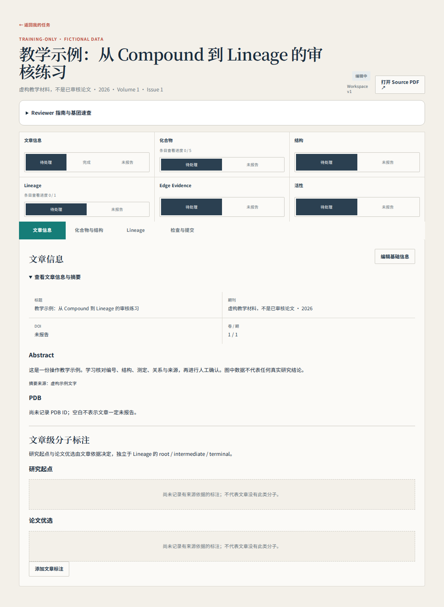
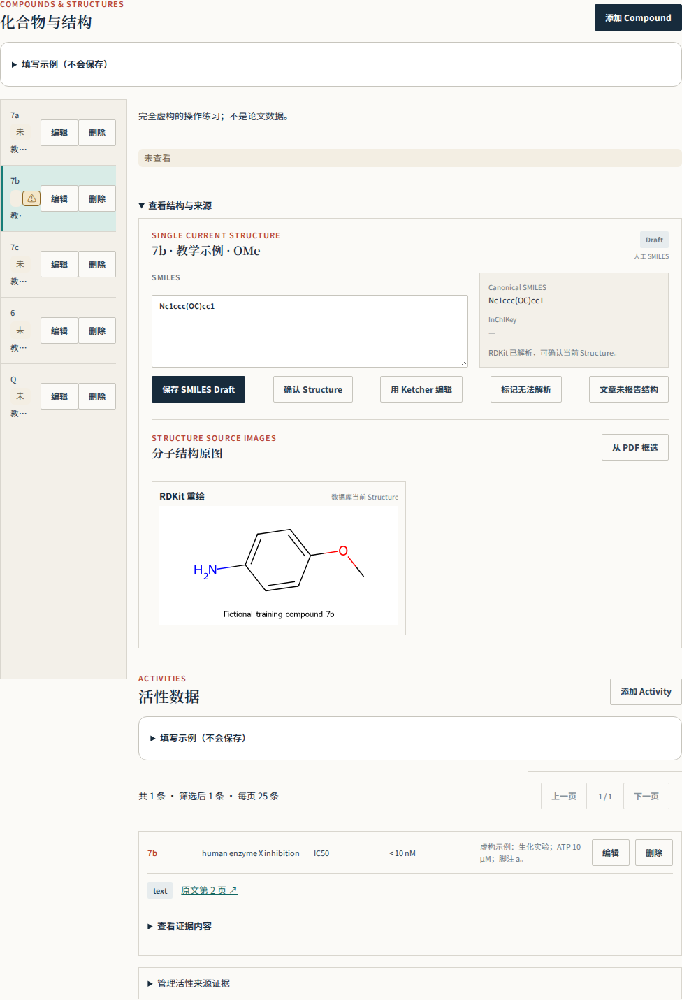
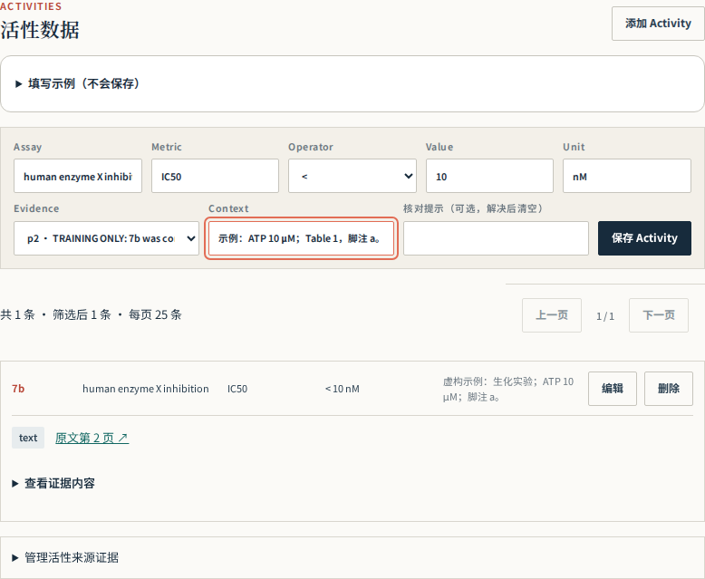
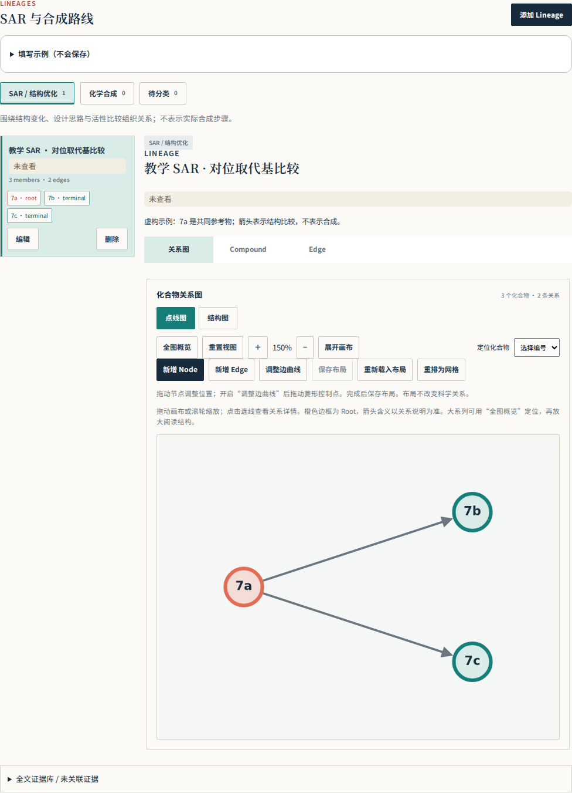
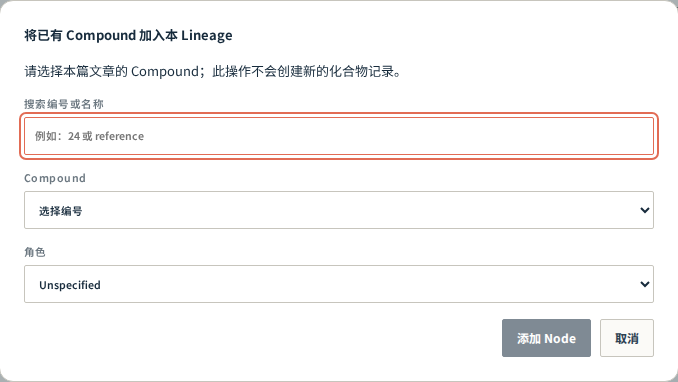
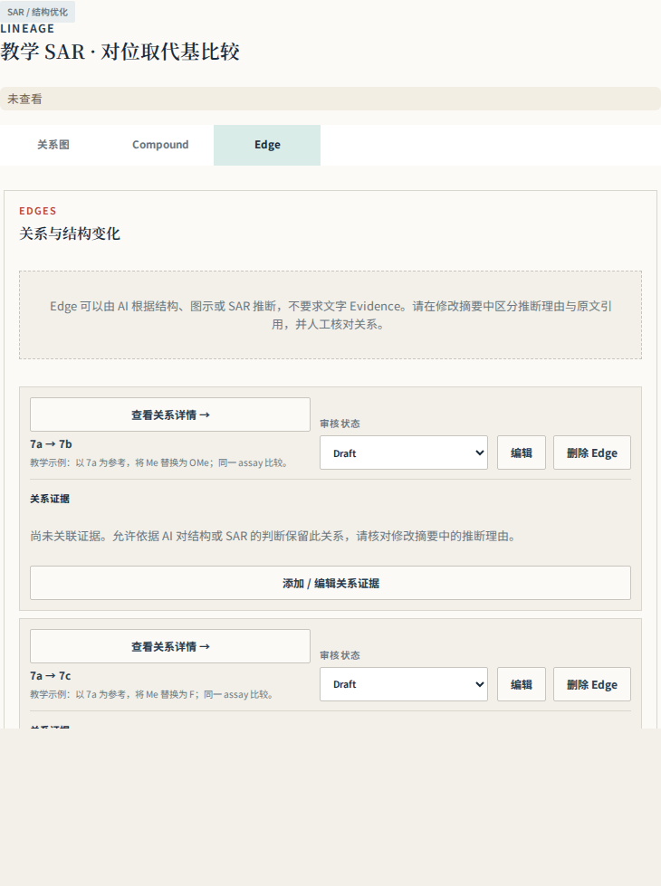
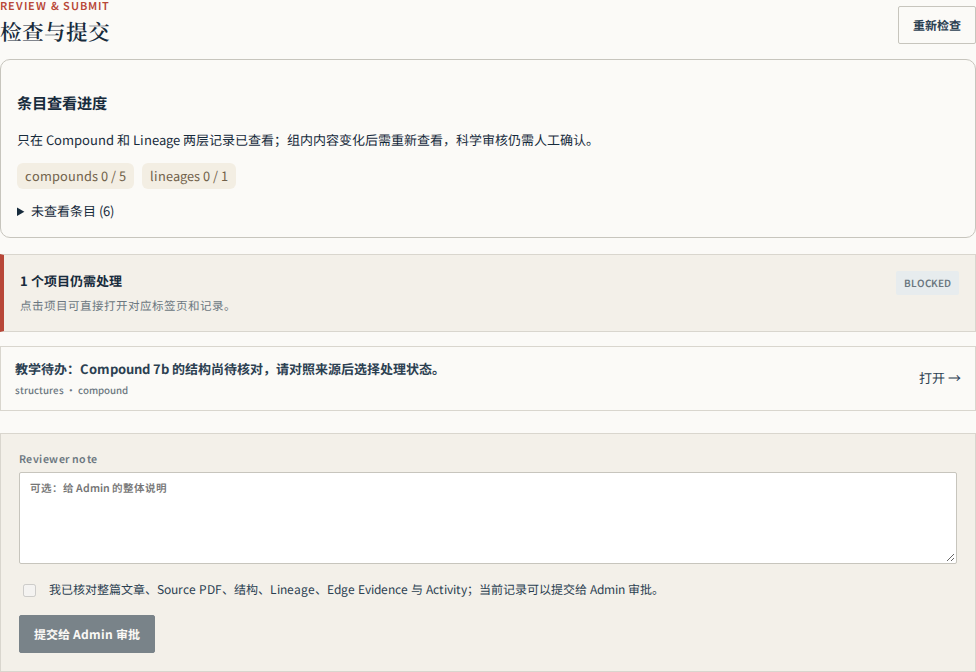

# Reviewer 图文上手手册

Version: 2026-10-08

> Generated from `leadtrace/frontend/src/review/help/reviewer-guide.json`. Edit that source and run `python leadtrace/ops/reviewer/render_guide.py`.

## 01 · 第一次使用：先走通一篇文章

你的任务是把论文中的信息核对成可追溯的数据。AI 预填是草稿；遇到不懂的化学问题可以保留疑点并请教负责人，不需要靠猜测完成。

1. 使用负责人提供的网址和 Reviewer 账号登录，从“我的任务”打开已分配文章。先核对题名与 DOI；Preview 横幅表示预览环境，练习与正式任务要分清。
2. 先读摘要、主要图表、合成 Scheme 和结论，理解作者研究什么靶点、从哪些分子开始、重点推进哪些分子。第一次不必立刻修改所有字段。
3. 按“文章信息 → 化合物与结构 → Lineage → 检查与提交”走一遍。先做一个 Compound：核对编号、结构、来源图、Activity；再检查它所在的 Lineage 和 Edge。
4. 每次只处理一项，保存后确认页面显示新内容。表单中的格式示例不是论文数据；不要直接保存示例。
5. 完成一组后复查疑点和来源，最后处理整篇覆盖与提交检查。先在负责人提供的教学任务中练习；实际文章里不要新增本手册的虚构分子。

> 本手册截图来自真实工作台界面，但使用虚构教学数据。图中数值、编号和研究结论仅用于学习操作。截图按钮会随中英文切换；正文保留 Compound 等常见字段名称，方便对照。



认清四个主要页签。上方的区段状态、已查看进度和科学审核状态用途不同，后文分别解释。

## 02 · 先认识 8 个对象

先把“分子是什么”“测了什么”“分子之间是什么关系”“依据在哪里”分开，就不容易填错位置。

| 对象 | 通俗解释 | 填写在哪里 / 例子 |
|---|---|---|
| Paper / Workspace | 论文 / 这篇论文的审核工作区 | 同一篇论文的记录放在同一工作区 |
| Compound | 原文中的一个化合物身份 | 编号 7a、24 或作者明确使用的标签 |
| Structure | 该化合物的化学结构 | 原子连接、键、取代位置、立体化学 |
| Activity | 该分子的一条测定结果 | 某种实验中的 IC50、溶解度等 |
| Lineage | 有共同设计逻辑或合成关系的一组分子 | SAR 优化系列，或一条合成路线 |
| Node / Member | 某个 Compound 在一个 Lineage 中的成员 | 加入已有 Compound，不是复制一份新化合物 |
| Edge | 组内两个 Compound 之间的一条关系 | A → B 的结构比较或合成转化 |
| Evidence | 支持或解释记录的来源 | PDF 页码、原文摘录、表格/图区域 |

一个 Compound 可以有多条 Activity，也可以参与多个 Lineage。例如同一分子既是合成终产物，也用于 SAR 比较；仍只保留一个对应的 Compound，分别加入需要的组。

## 03 · 先核对文章，再做完整清点

核对题名、DOI 和 PDF。收录所有有编号或标签且结构可确定的 Compound，包括无活性数据的原料、中间体和对照。示例仅演示格式，不应复制为论文事实。

1. 核对题名、DOI、期刊和年份；打开 Source PDF，确认正文确实属于这篇文章。若打开错文献，先暂停该篇并报告。
2. 记录 PDF 阅读器的实际页码（从 1 开始），不要把印刷页码 3456 填成 PDF 第 3456 页。正文写“Table 2”时同时记录它在 PDF 的哪一页。
3. 逐处检查正文、图表、Scheme、实验方法与当前可获得的补充材料。建立清单：原文标签、出现位置、是否有可确定的结构、是否已录入、疑点。
4. 按编号段检查覆盖，例如发现 24–31 和 55–73，要逐个对照清单。编号连续不证明结构相同；编号有缺口也不证明一定漏记，回原文确认。
5. 原料、中间体、活性对照和比较分子，只要来源能识别其标签并确定结构，就在 Compound 范围内。没有 Activity 不是排除理由。

> 仅知道编号、完全无法确定结构时，不要复制邻近分子的结构凑数。在核对记录/给负责人的问题清单中保留编号、页码与缺失原因。结构有完整来源支持但仍有某项不确定时，可保留候选并具体说明“需核对”；这与凭空造结构不同。缺少 SI 时记录范围限制，不写“全文已确认无遗漏”。

## 04 · Compound：编号与身份怎么填

Compound label 保留原文编号（例：24、7a）；显示名称可为空。每个 Compound 维护一个 Structure；SMILES/结构编辑器输入后核对连接、取代位置和立体化学。不能确定时说明原因并明确 unresolved，不虚构结构。

| 字段 | 应该填什么 | 常见错误 |
|---|---|---|
| Compound label | 原文标签，保留 7a、(R)-24 等有意义的区别 | 用自己编的连续编号替代原标签 |
| 显示名称 | 作者别名或清晰的常用名称；没有可留空 | 把别名中的数字自动当成 Compound label |
| 描述 | 分子的用途、来源、系列、未加入 Lineage 的理由 | 只写“无”，让下一位 reviewer 无法判断 |
| 需核对 | 具体疑点＋来源位置＋下一步要核对什么 | 只写“AI 可能有错”或未经解决就清空 |

1. 从“化合物与结构”左侧选择编号，确认右侧详情也是同一个分子。需要补录时点击“添加 Compound”，先检查清单中是否已有同一标签。
2. 保存编号后完成结构与来源核对；要补充用途或疑点，使用该条目的“编辑”。先核对结构相同是否意味着同一身份，不要仅凭结构相同就合并作者明确区分的条目。
3. 立体异构体、盐型、互变异构形式和重用编号容易混淆。以作者标注和明确结构为准；不懂该如何区分时保留说明，请负责人确认，不自行标准化。



左侧是本篇 Compound 清单，右侧是所选分子的结构与来源、Activity。一次核对一个编号，避免看着上一条的图填写下一条。

## 05 · 结构复核：画得像还不够

不会手写 SMILES 也可以先学习逐项对照结构图；无法独立判断时不要点“已确认”。结构复核的重点是原子和键的连接关系。

1. 锁定来源：寻找该编号的结构图，或“共用骨架＋该编号的取代表”。R、R¹、R² 是变量，不是已确定的原子；必须逐个对应本分子的取代基。
2. 看骨架：沿每个环走一圈数原子，区分五元/六元环；看清稠环共用一条边、螺环共用一个原子、桥环的连接方式。不要靠整体轮廓或名称相似判断。
3. 看原子：C、N、O、S 是否在正确位置？芳环中一个 N 的位置改变就是另一个结构。未标出的顶点通常是碳，但必须结合规范的骨架式阅读。
4. 看取代：从骨架连接点沿支链检查 Me/OMe、Ph/Bn、链长、邻间对位。Ph 直接接芳环；Bn 多一个 CH₂；OMe 比 Me 多一个 O。
5. 看键和状态：单/双/芳香键、羰基位置、形式电荷、标明的氢、盐的组成，以及实楔/虚楔和 E/Z。不要替原文补出未指定的立体化学。
6. 保存后检查重新生成的结构图。SMILES 字符串可能有多种等价写法；软件能解析只说明格式可读，不证明与原文一致。最后根据实际核对结果选择结构状态。

两种输入方式都直接保存同一个 Structure。使用 Ketcher 时，完成绘图后点击“保存 Ketcher Draft”；解析成功后，上方 SMILES 会自动显示生成结果，下方 RDKit 重绘会随保存后的结构更新，不需要手动复制或再保存一次 SMILES。若直接修改 SMILES，点击“保存 SMILES Draft”也会更新重绘。图对应已保存的结构，不随尚未保存的输入变化；无效结构草稿没有可用重绘，仍需修订。保存 Draft 不等于科学确认，复核来源后再点“确认 Structure”。

| 状态 | 含义 / 使用时机 |
|---|---|
| draft | 录入或 AI 预填后尚未完成复核 |
| reviewer_confirmed | 你已对照来源核实当前结构 |
| unresolved | 有来源歧义或当前无法解决的问题；写清原因 |
| not_reported | 来源未报告相应结构信息；先确认是真的未报告，不是找不到或不会画 |

> 新手最容易漏的是环大小、杂原子位置和连接点。若三个细节中有一项无法确定，记录具体问题并保留未决。截图只截到通式骨架时，还必须核对同一编号的 R 基取代表。

> 实际按钮注意：“标记无法解析”和“文章未报告结构”会将当前 SMILES / Molfile 清空并保存为无结构状态。已有完整候选但只是某处存疑时，保留 Draft，在 Compound 核对提示中说明；不要把这两个按钮当作普通警告开关。确需无结构处置时先保留来源与问题记录，并与负责人核对。

## 06 · Activity：一条测定拆成哪些字段

例（虚构）：Assay = human MAO-B inhibition；Metric = IC50；Operator = <；Value = 10；Unit = nM；Context 写明测定条件。不要把 <10 nM 全部塞进 Value，不混合不同 assay 的数值。保留原单位与限制条件。

| 字段 | 虚构示例 | 怎么理解 |
|---|---|---|
| Assay | human enzyme X inhibition | 测的是什么靶点、体系；不要只写“活性” |
| Metric | IC50 | 指标名；不同于 Ki、EC50、抑制率 |
| Operator | < | 原文是小于；不要丢掉不等号 |
| Value | 10 | 只填数值 |
| Unit | nM | 原文单位；1 μM = 1000 nM |
| Context | 生化实验；ATP 10 μM；Table 1 脚注 a | 保留条件、重复数、误差和限定说明 |
| Evidence | PDF 第 2 页，Table 1，7a 行 | 关联能定位到该结果的来源 |

IC50 通常指达到 50% 抑制时的浓度；在同一实验体系中数值较小通常表示更强抑制。EC50、Ki、Kd、细胞存活率、溶解度和暴露量回答不同问题，不能混在一起排名。不同靶点、物种、细胞系、时间或测定条件的 IC50 也不能直接当成一次优化前后。

1. 确认正在编辑的是对应 Compound，再点击“添加 Activity”。同一分子在不同 assay 下的数据分别保存，不用覆盖原有那一条。
2. 横向检查行标签、列标题、单位和脚注。看到 12 ± 3 nM，Value 填 12，误差“±3”及其 SD/SEM 定义保留到 Context；不要自行猜误差类型。
3. ND、NT、inactive 等文字不是数值 0。保留原文含义和条件，在说明/证据中记录；当前数值表单无法准确表达时请负责人确定处理方式，不编造数字。
4. 保存后点开证据检查截图，确认确实是本编号、本指标、正确单位的那一格。



虚构的 <10 nM 示例：运算符、数值和单位分别填写，Context 记录实验条件；Evidence 指向来源。

## 07 · Evidence 与截图：让别人能复核

关系类型、起终点、修改摘要都要核对。例（虚构格式）：Me → OMe，比较亲脂性变化；该关系由结构比较推断，未见作者明确说明。区分原文支持与推断，不把表格并列当优化顺序。Evidence 保留逐字引文、PDF 实际页码和区域；supports/contradicts/contextual 表示证据作用。阅读不自动把 draft 改为 reviewer_confirmed。

Evidence 是可复核的出处。quoted text 放逐字原文；Caption 用来标明 Table/Figure/Scheme；Reviewer note 放你的解释、翻译或推断。不要把你的推断写成带引号的作者结论。

1. 从当前 Activity 的证据入口或 Lineage 的“添加 / 编辑关系证据”打开 Evidence；可复用已有证据，不必为同一原文反复新建。
2. 确认 PDF 页码和页面方向，再框选区域。Activity 表格尽量包含化合物行标签、列标题、单位及关键脚注；区域过大看不清，过小无法判断。
3. 保存后检查实际生成的截图，别只看框选动作是否成功。逐一核对编号、指标、数值、单位、脚注有没有截错行/列。
4. 若截图为空、偏移或截到了相邻结果，重新核对页码和区域后修正来源记录；有“重试”时可重试生成，但错误坐标不会因为重试自动变正确。
5. Edge 证据选择 supports / contradicts / contextual，分别表示支持、反驳、提供背景。同一段文字可能只支持某一条关系，不要不加区分地关联整张图的所有边。

> 暂时没有生成图片不等于原文没有数据；有一张图片也不等于数据已经核对正确。跨页表格可能需要结合多个来源位置阅读，Reviewer note 应写明需要一起看的位置。

## 08 · Lineage：先分清 SAR 与合成

SAR 记录设计和结构比较，synthesis 记录实际合成路线；不要仅凭编号顺序连边。同一逻辑路线的节点属于同一 Lineage；独立路线可分开。root 是路线起点，intermediate 为途中节点，terminal 为路线终点；terminal 不自动表示最佳活性或作者最终候选。作者研究起点与优选分子在文章级标注中记录。孤立对照不必强行连边，在 Compound 描述说明其用途及不入 lineage 的理由。

| 类别 | 回答什么问题 | 可以依据什么 | 不能怎样做 |
|---|---|---|---|
| SAR | 作者如何比较/设计结构并探索性质变化？ | 明确设计叙述、结构比较、同条件测定与范围说明 | 按编号 1→2→3 自动连成链 |
| synthesis | 哪些前体经反应得到哪些产物？ | Scheme 箭头、实验方法、明确的多步路径 | 把活性变好当成合成关系 |
| 孤立对照 | 为什么有这个分子但没有优化关系？ | 用于初始活性比较或外部标准的说明 | 为了让所有节点连通而编造 Edge |

1. 先用一句话写该 Lineage 的共同问题，例如“比较同一骨架对位取代基”；另一个 Lineage 可写“制备该系列终产物的共同合成路线”。
2. 把属于同一逻辑路线或比较系列的成员放在一起。图上分散时，先判断是否只是布局，再检查是否漏 Member/Edge、选错端点或混入独立路线。
3. 若缺少来源支持，先写疑点；不要为了视觉连通而添加无依据的关系。如果确为独立系列/路线，再按科学逻辑分组。SAR 的证据可能只支持部分成对关系，应如实记录。
4. 共同中间体通向多个产物时允许分叉，不要把所有产物串成一条线。跨组共用分子可复用同一个 Compound。

```text
虚构 SAR 示例
7a（Me） → 7b（OMe）
7a（Me） → 7c（F）
已说明共同参考物；箭头表示有依据的比较，不表示 7b 合成出 7c。
```



同一示例 Lineage 的分叉关系。先看类别与分组理由，再看成员和每条边的来源；节点的位置只是展示。

## 09 · Root、Intermediate、Terminal 与文章标注

Lineage 角色描述分子在当前组中的位置；“研究起点／论文优选”描述作者在整篇研究或指定系列中的选择。两者分别核对。

| 名称 | 如何判断 | 不代表什么 |
|---|---|---|
| root | 当前有向关系组的起点；核对关系方向和上下文 | 不自动等于整篇研究起点 |
| intermediate | 当前组中间的节点，通常同时接收和引出关系 | SAR 中不自动表示合成中间体 |
| terminal | 当前组末端节点；没有继续向后的已记录关系 | 不自动等于最好活性、最终药物或论文优选 |
| unspecified | 尚不能确定该组内角色，需继续核对 | 不是为了省事永久不标 |
| 研究起点 | 作者据以启动本文/该系列优化的分子，有来源理由 | 不是每个便宜试剂或每条路线的第一个原料 |
| 论文优选 | 作者明确选择优先推进的分子，有选择依据 | 不是所有 terminal，也不是你自己挑最低 IC50 |

同一个 Compound 在不同 Lineage 可以有不同角色。一个研究可以有多个起点和多个优选；同一分子也可能兼任。判断关键是“作者在什么范围、为什么这样选”，不是分子排在第几行。

## 10 · 在画布和表单中编辑 Lineage

三个页签切换。图上“新增 Node”选择本篇已有 Compound；找不到时先到化合物页创建。“新增 Edge”依次选择起点和终点，再填写关系表单。拖动节点或菱形控制点调整形状，点击“保存布局”；点线图与结构图独立保存。重新载入布局会丢弃该模式未保存的布局。表单仍是完整编辑入口。

1. 选择正确的 SAR / synthesis 类别和 Lineage，再切换“关系图／Compound／Edge”页签；一个页签占主要操作区域。
2. 画布点击“新增 Node”，搜索并选择本篇已有 Compound，再选组内角色并确认。找不到编号时先检查它是否已在该组中；若本篇清单没有，再回化合物页补录。
3. 点击“新增 Edge”，按提示先选来源分子、再选目标分子；进入 Edge 表单后再次检查两个编号、方向、关系类型、修改摘要及证据。保存前取消不会建立关系。
4. 也可以在 Compound 页签添加 Member，在 Edge 页签使用完整表单。两种入口编辑同一组记录。
5. 拖动节点调整位置，打开边曲线调整后拖动菱形控制点；点击“保存布局”。点线图与结构图的布局分开保存。
6. “重新载入布局”会放弃当前模式未保存的位置；“重排为网格”是重新布局。移动节点或弯曲连线不会改变 Edge 端点或科学审核状态。



“新增 Node”选择的是本篇已有 Compound；角色属于当前 Lineage。先核实编号，再确认添加。

## 11 · Edge：写清“变了什么”和“凭什么连”

每条边都应有可解释的端点、方向和关系。描述应区分结构差异、测定结果、作者解释与 reviewer 推断。

| 检查项 | 推荐写法 / 做法 |
|---|---|
| 端点与方向 | 先读 Parent / Child 的编号，再对照来源。合成通常前体→产物；SAR 方向按明确的参考/设计关系解释，不等于历史时间线。 |
| 关系类型 | 依实际关系填写；例如 SAR 比较与合成转化不混用。类型字段不替代完整说明。 |
| 修改摘要 | 虚构：相同骨架上对位 Me 替换为 OMe；同一 assay 的 IC50 由 120 nM 变为 40 nM。 |
| 结论边界 | 可以说该 assay 抑制更强；未测 logP 就不能把“亲脂性降低”写成已测事实。 |
| 推断标识 | 虚构：按结构比较建立，未见作者明确说明优化先后；方向以 7a 为参考物，不主张合成关系。 |
| 审核 | 读完来源后明确选 draft / reviewer_confirmed / unresolved；有冲突保留说明。 |



Edge 页签用于逐条核对端点、关系和审核状态。证据说明为何可以建立这条边，不能只凭图画得顺眼。

## 12 · 给研究起点／论文优选添加依据

在文章信息页关联本篇 Compound 与已有 Evidence，记录研究起点或论文优选、适用系列/范围及作者选择理由。每类可有多个分子，同一分子可兼任。先在 Evidence 库保存原文依据；标注卡片保留 PDF 页码与原文。研究起点不等于每条合成路线的原料；论文优选不等于所有 terminal 或最低 IC50。待审核、已确认、待解决分别显示，阅读不会自动确认；未记录不代表文章没有此类分子。修改理由、身份或来源后重新核对，需核对提示要显式清除。

1. 阅读 Introduction、Results/Discussion 和结论，找作者明确的起点或优先推进表述；结合 Figure/Table 核对化合物编号和别名。
2. 先在 Evidence 中保存相关原文与 PDF 页码，再到“文章信息”点击“添加文章标注”。
3. 选择本篇 Compound、标注类别、适用范围（例如全文或 Series A）、作者选择理由和来源 Evidence。理由可以包括活性、选择性、PK、脑暴露或体内效果，但只能写来源支持的部分。
4. 确实核实后设为已确认；存在身份/依据冲突就设为待解决并解释。修改身份、理由或来源后重新核对，不能沿用旧的确认判断。

> 某分子在体外最强，但作者因暴露量差而放弃，不能标为论文优选。某化合物只作为外部药物对照，也不能因为出现在 Figure 1 就标为研究起点。

## 13 · Abstract 与 PDB：来源和用途要分开

Abstract 保存原文摘要及来源，不使用 AI 总结冒充。PDB ID 支持传统四字符与 pdb_ 前缀扩展格式；ATP 等三字符配体代码不是 PDB ID。区分本文结构、引用结构、用途待核对；记录页码和上下文。仅来源明确时关联 Compound。空白只代表未记录，不能自动判定文章未报告。

1. 点击“编辑基础信息”填写原文 Abstract 和来源。摘要翻译或自己的概括不能替换原文摘要。
2. 在正文、结构解析方法和 Accession Codes 中查找 Protein Data Bank / PDB，逐个记录明确编号。先确认它是结构编号，不是配体三字码、基因编号或实验耗材型号。
3. 判断用途：本文新测定并沉积的实验结构填“本文结构”；下载已有坐标做 docking、结构比较或分子置换填“引用结构”；无法判断时填“用途待核对”并说明。
4. 填写 PDF 实际页码和来源上下文。只有原文明确结构与分子身份配对时才填关联 Compound；对接了化合物 7 并不证明该 PDB 晶体里就是 7。
5. 同一编号多次出现通常合并说明用途和补充页码。原文编号或蛋白名冲突时保留来源并写需核对，不静默改成自己觉得更合理的编号。

查过正文但没有找到编号，准确写法是“已检查当前 PDF，未见明确 PDB 编号；SI 尚未检查”（如果确实如此）。空白字段只表示未记录，不能拿空白当作“作者没有报告”的证据。

## 14 · 已查看 ≠ 已确认：理解页面状态

只在 Compound 和 Lineage 两层记录已查看。主动选择 Compound 或 Lineage（含打开其 Edge 详情）后记录；后台加载和浏览整张图不批量确认所有组。Compound 包含基本信息、结构、来源图、活性及关联证据；Lineage 包含成员、成员化合物内容、Edge 及关联证据。相关内容变化使所属组已读失效，无关组不受影响；可以标记未读。只显示这两类计数，结构、Activity、Edge、Evidence 不再分别打勾。文章信息保留人工区段确认；无归属 Evidence 在证据库查看，由最终整篇确认覆盖。旧细粒度回执不自动升级为整组阅读，需要重新打开当前组。颜色仅辅助，文字为准。已查看不是科学批准，不清空“需核对”，不自动确认 Structure/Edge。无内容区段仍需明确未报告，最后须人工勾选整篇确认并提交，Admin 再审批。

| 页面信号 | 代表什么 | 你还需要做什么 |
|---|---|---|
| Compound / Lineage 已查看 | 系统记录你主动打开过当前版本的这一组 | 核对组内全部相关内容；自动记录并不证明你已理解 |
| ⚠ 需核对 | 该条目有明确疑点；点击图标展开文字 | 对照来源解决问题后编辑清空提示；阅读/确认不会自动清除 |
| draft / 待审核 | 科学处理尚未完成 | 判断当前结构/关系/文章标注是否可确认 |
| reviewer_confirmed / 已确认 | reviewer 明确作出的科学判断 | 修改内容后重新检查其依据 |
| unresolved / 待解决 | 问题尚未解决，已明确记录 | 说明问题并交接负责人，不能等同已正确 |
| 区段未报告 | 审核后判断该区段在来源中未报告 | 说明依据；不能用来绕过未做完的工作 |

现在只记录 Compound 和 Lineage 两级已查看。Compound 组包括结构、来源图、Activity 和关联证据；Lineage 组包括成员、成员内容、Edge 和证据。相关内容修改会使相应组需重新查看，布局调整不等于科学修改。不要为把计数刷满而快速逐条点开。

## 15 · 提交前：逐条处理阻断项

提交会冻结当前内容，交给 Admin 审批。你的最后一次整篇确认仍是必需步骤；程序检查通过也不能代替源文审核。

1. 完成 Compound、Lineage 以及相关结构/关系/文章标注的核对后，进入“检查与提交”，点击“重新检查”。
2. 有未查看组时点对应条目回去检查；修改了组内内容后，再查看当前版本。文章信息仍需人工区段确认。无归属 Evidence 也要在证据库检查，并纳入最终整篇确认。
3. 逐个打开阻断项，根据实际原因处理：例如结构仍是 draft、Edge 尚未审核、Lineage 角色不完整、文章标注缺依据或查看记录过期。不要为了通过检查统一改为已确认。
4. 源文确实未报告的空区段明确选择未报告。对 unresolved 项和范围限制，在 Reviewer note 中交代；若系统允许提交带未决项，也必须让 Admin 知道，提交不代表问题已解决。
5. 复查整篇覆盖、结构来源、Activity 单位、Lineage 逻辑和所有疑点。确认可以交接后，人工勾选整篇确认并点击“提交给 Admin 审批”。
6. 提交成功后内容被冻结；Admin 可以批准或退回修改。批准后才进入正式文章页面。需要修正已提交内容时按退回流程处理，不通过重复新建文章绕过。



教学示例故意保留一个待处理项：点击问题定位并核对，完成前不要勾选整篇确认。

## 16 · 常见问题：先判断，再操作

科学记录保存使用 Workspace 版本；发生冲突时重新读取并核对，不覆盖别人的修改。布局有独立版本，已读不增加科学版本。需要核对的记录可保持提示与草稿；不要为通过提交检查而随意确认。

| 遇到的情况 | 建议处理 |
|---|---|
| 新增 Node 找不到编号 | 检查是否选错文章、已是该组成员，或 Compound 尚未录入；不要重复新建。 |
| 一组图散成几块 | 先区分布局与科学关系；查漏边/错端点/错误分组，缺来源时保留疑点。 |
| 活性截图截错行 | 回 PDF 对照行标签、表头、单位、脚注；修正页码/区域后重新核对实际图片。 |
| 保存提示版本冲突 | 保留未保存的文字，重新读取最新记录并逐项比较；避免多个窗口同时编辑同篇。 |
| 有 ⚠ 但看不到说明 | 点击图标展开；只阅读不会清空提示。 |
| 已读又变未读 | 相关内容已更改，重新核对当前版本；不是让你重复确认旧内容。 |
| 不能提交 | 打开检查页逐项定位原因；区分未查看、draft、无来源、角色问题与真正未报告。 |
| 按钮只读或无法编辑 | 检查账号角色和任务状态：Admin 查看或已提交/批准可能只读；联系负责人走正常修改流程。 |
| 不懂杂环、立体化学或实验指标 | 记录化合物编号、PDF 页码、具体位置和问题，交给负责人；不要猜测或伪造确定性。 |

## 17 · 五分钟自测：能说清理由才算会

以下案例完全虚构，可在纸上回答，不需要在实际数据库创建。先想答案，再展开解释。

假设论文报告 7a、7b、7c 三个同骨架分子，分别为 Me、OMe、F 取代；同一 assay 的 IC50 为 120、40、15 nM。作者明确写“以 7a 为参考比较 7b 和 7c；因 7b 暴露量更好，选择 7b 做体内验证”。对照 Q 仅用于初始活性比较；合成路线另有编号中间体 6。

**哪些分子进入 Compound？**

7a、7b、7c、Q，以及中间体 6，只要各自有来源可确定的结构。6 没有活性也应收录；Q 不需要为了进清单而强行连入优化图。

**应该画 7a→7b→7c 吗？**

不应仅按编号串联。这里有明确共同参考物，可记录 7a→7b、7a→7c 的 SAR 比较；实际合成关系另看 Scheme，不能由这些 IC50 推断。

**谁是论文优选？**

7b：作者明确选择它进行体内验证，有暴露量的理由。7c 的 IC50 最低也不能取代作者选择。7a 的研究起点仍需确认来源是否明确把它作为本研究/系列起点；“参考物”本身不总是足够。

**看到 7c 的 IC50 <15 nM 应该怎么填？**

Metric=IC50，Operator=<，Value=15，Unit=nM；检查该数值的行列和脚注，保留条件。不能记成等于 15 或 0。

**把所有组点到已读，可以直接提交吗？**

不行。已查看不表示科学核对完成。还要处理结构/Edge/文章标注状态、来源问题和检查阻断项，再做人工整篇确认。

## 18 · 完成标准与求助模板

一份好的审核结果应让下一位读者找到来源、理解判断，并清楚知道哪些地方仍待解决。

1. 编号覆盖：原文可识别且结构可确定的分子已逐个核对，缺口和 SI 范围限制有说明。
2. 身份与数据：结构连接/环系/立体化学、Activity 指标/数值/单位/条件，与来源逐项一致。
3. 关系与角色：SAR/合成分开，分组和 Edge 有依据；组内角色与文章级作者选择分别判断。
4. 可追溯性：页码、引文和实际截图可定位；所有提示与未决问题写得具体，不被无依据地清除。
5. 交接：当前内容已保存，查看覆盖和科学状态真实，Reviewer note 告知未决及范围，最终确认由你作出。

```text
求助示例（虚构）
文章：TRAINING-001
对象：Compound 7b / Structure
来源：PDF 第 2 页，Scheme 1 与 Table 1
问题：通式画出六元含氮环，但当前结构是五元环；不确定是否套用了错误骨架。
已做：核对编号与 R 基行；尚未确认结构，保留需核对。
需要：请负责人核实环大小和杂原子位置。
```

## 19 · 基团缩写速查

缩写只有结合原文定义和连接点才有意义。先查作者的图例，再查此表；大小写、前缀和连接原子不能省略。可使用浏览器查找（Ctrl+F / ⌘F）。

| Symbol | 含义 | 核对要点 |
|---|---|---|
| Me | 甲基 | –CH₃；OMe 含额外的氧连接。 |
| Et | 乙基 | –CH₂CH₃ |
| n-Pr / i-Pr | 正丙基 / 异丙基 | –CH₂CH₂CH₃ / –CH(CH₃)₂；连接位置不同。 |
| n-Bu / i-Bu / s-Bu / t-Bu | 丁基异构体 | 分别为正丁基、异丁基、仲丁基、叔丁基；不能互换。 |
| Ph | 苯基 | –C₆H₅；直接通过芳环连接。 |
| Bn | 苄基 | –CH₂C₆H₅；比 Ph 多一个亚甲基。 |
| Be | 铍（元素符号） | 不是标准苄基或苯基缩写；不得自动纠正为 Bn/Ph，先核对原文定义或印刷。 |
| OMe / OEt / OBn | 甲氧基 / 乙氧基 / 苄氧基 | 通过 O 连接；不同于 Me/Et/Bn。 |
| Ac | 乙酰基 | –C(=O)CH₃；OAc 为乙酰氧基，保留连接原子。 |
| Boc | 叔丁氧羰基 | 常见氨基保护基；记录结构中实际连接位置。 |
| Cbz / Z | 苄氧羰基 | 保护基，不等于 Bn。 |
| Fmoc | 芴甲氧羰基 | 保护基；按图核对连接。 |
| Ts / Ms / Tf | 对甲苯磺酰基 / 甲磺酰基 / 三氟甲磺酰基 | 与 OTs/OMs/OTf 的连接原子不同；注意盐和共价基团的区别。 |
| Ar / HetAr | 芳基 / 杂芳基（泛指） | 不是唯一结构；结合具体定义和取代位置。 |
| R / R¹ / R² | 变量基团 | 只有在该化合物的取代表中明确后才能展开。 |
| o- / m- / p- | 邻位 / 间位 / 对位 | 二取代苯环通常对应 1,2 / 1,3 / 1,4；仍核对编号体系。 |
| H / F / Cl / Br / I | 氢 / 氟 / 氯 / 溴 / 碘 | 元素符号区分大小写；Cl 不是 C 和 I。 |
| CF3 / CN / NO2 | 三氟甲基 / 氰基 / 硝基 | 核对连接原子与完整价态；不能只按字符数画结构。 |
| c-Pr / c-Bu | 环丙基 / 环丁基 | c- 表示环；不同于直链或支链 Pr/Bu。 |
| Py / pyridyl | 常指吡啶或吡啶基，依原文定义 | 必须核对 2-/3-/4- 连接位和 N 的位置；不可只凭 Py 推断唯一结构。 |
| TMS / TBDMS (TBS) / TBDPS | 常见硅基保护基 | 分别核对硅上取代基及连接位置；保护/脱保护会改变实际结构。 |

[参考：PDB 标识符格式](https://www.rcsb.org/docs/general-help/identifiers-in-pdb)
